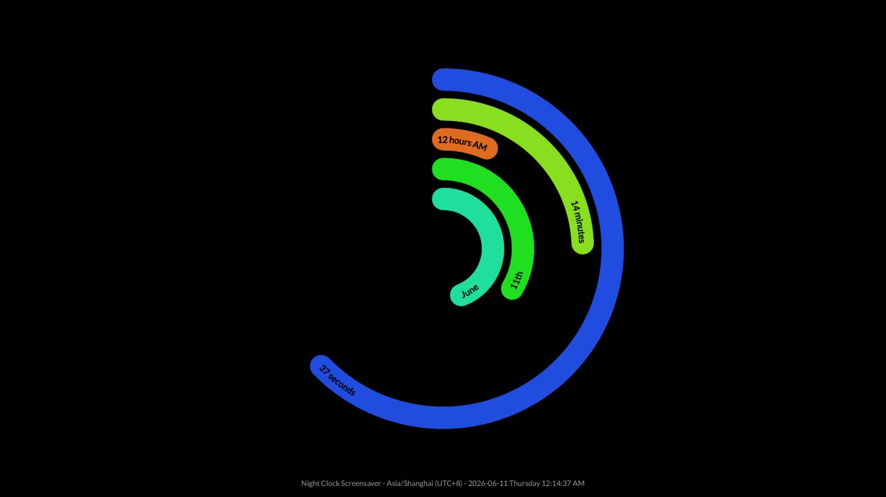

# `nclock-background`

Fancy dynamic night clock wallpaper engine and screensaver for Wayland compositors.

## Overview

`nclock-background` renders an animated clock as a Wayland layer-shell wallpaper, with orbiting hands that sweep across a configurable HSL color range. It consists of two components:

- `nclock-background`: The wallpaper renderer itself. Connects to your compositor via the `wlr-layer-shell-unstable-v1` protocol and draws directly with OpenGL.
- `nclock-screensaver`: A management process that spawns the wallpaper with `--exit-on-input --layer overlay`, monitors it for finalization, and spawns a locker (e.g. `swaylock`) when the maximum idle period expires.

The wallpaper exits gracefully on any keyboard or pointer input when run with `--exit-on-input`, making it suitable for use as a screensaver that yields to the locker on user activity.



## Usage

### Standalone wallpaper

```sh
nclock-background
```

Available CLI options:

```plain
Usage: nclock-background [OPTIONS]

Options:
      --relative-inner-radius <RELATIVE_INNER_RADIUS>
          Inner radius of the innermost orbit, as a fraction of the
          display height [default: 0.1]
      --relative-lane-width <RELATIVE_LANE_WIDTH>
          Width of each orbit lane, as a fraction of the display height
          [default: 0.045]
      --relative-lane-margin <RELATIVE_LANE_MARGIN>
          Margin between adjacent orbit lanes, as a fraction of the
          display height [default: 0.015]
      --hue-start <HUE_START>
          Start of the hue interval mapped to the pointer angle (0.0 =
          red) [default: 0.0]
      --hue-end <HUE_END>
          End of the hue interval mapped to the pointer angle (1.0 =
          red) [default: 1.0]
      --layer <LAYER>
          Which layer shell layer to use [default: background]
      --namespace <NAMESPACE>
          Namespace string sent to the compositor with the layer surface
          [default: nclock-background]
      --exit-on-input
          Exit the program when a key is pressed or mouse is clicked
      --exit-delay-ms <EXIT_DELAY_MS>
          How long to keep rendering after another process requests
          finalization before exiting [default: 0]
      --notify-finalization
          Print `"finalizing"` to stdout when another process requests
          finalization
  -h, --help
          Print help (see more with '--help')
  -V, --version
          Print version
```

### Screensaver with minimal idle management

`nclock-screensaver` is a dedicated manager of `nclock-background`. No other wallpaper program is supported.

```sh
nclock-screensaver \
  --grace-period-secs 30 \
  --maximum-period-secs 600 \
  --locker-cmd "swaylock --grace 5"
```

Note that `nclock-background` is required to be in `$PATH` if `--wallpaper-cmd` is not specified, although the Nix package automatically wraps the program with `nclock-background` included.

Available CLI options:

```plain
Usage: nclock-screensaver [OPTIONS]

Options:
      --grace-period-secs <GRACE_PERIOD_SECS>
          How long after screensaver start the user can exit without
          spawning the locker [default: 30]
      --maximum-period-secs <MAXIMUM_PERIOD_SECS>
          Maximum idle time before forcefully stopping the screensaver
          and spawning the locker [default: 900]
      --wallpaper-cmd <WALLPAPER_CMD>
          Wallpaper command with arguments, e.g. `"nclock-background
          --exit-delay-ms 1000"`. Some extra arguments are automatically
          prepended
      --locker-cmd <LOCKER_CMD>
          Locker command with arguments, e.g. `"swaylock --grace 5"`. If
          omitted, no locker is spawned on timeout
  -h, --help
          Print help
  -V, --version
          Print version
```

## Build

### Cargo

Requires Rust 1.85 or later (2024 edition). The toolchain is pinned via `rust-toolchain.toml`.

```sh
cargo build --release
# Or build a specific binary:
cargo build --release --package nclock-background
cargo build --release --package nclock-screensaver
```

### Nix

Replace `<system>` with your target platform: `x86_64-linux`, `aarch64-linux`, `x86_64-darwin`, or `aarch64-darwin`.

```sh
nix build .#packages.<system>.nclock-background
nix build .#packages.<system>.nclock-screensaver
```

## License

This project is licensed under [GPL-3.0-or-later](/LICENSE) for the Rust source code (`crates/`), [MIT](/LICENSE-NIX) for Nix source code (`flake.nix`, `nix/`), and [CC-BY-SA-4.0](/LICENSE-DOCS) for documentation (`README.md`, `docs/`).

Copyright (C) 2026 Justin Chen and contributors
